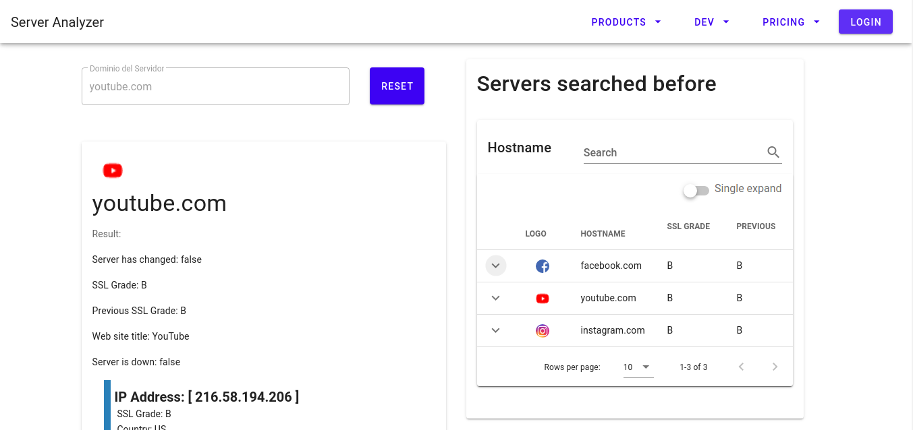

last update in [mods](https://github.com/leofrancocalpa/server-analyzer-gui/tree/mods) branch
# server-analyzer-gui

> server analyzer



## Build Setup

``` bash
# install dependencies
npm install

# serve with hot reload at localhost:8080
npm run dev

# build for production with minification
npm run build
```
You must have the backend running - [server-analyzer](https://github.com/leofrancocalpa/server-analyzer).

For detailed explanation on how things work, consult the [docs for vue-loader](http://vuejs.github.io/vue-loader).

